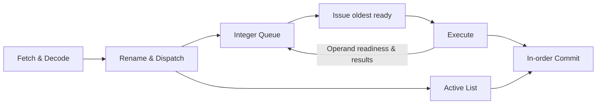

# Out-of-Order Processor Simulator

A cycle-by-cycle **C++17 simulator of a four-wide out-of-order processor**, developed for EPFL's CS-470 Advanced Computer Architecture course. It models how instructions are renamed, scheduled when their operands become ready, executed out of order, and committed in program order.

The simulator turns a JSON instruction stream into a detailed execution trace, making register dependencies, pipeline stalls, and exception recovery inspectable at every clock cycle.

**Technical focus:** computer architecture · register renaming · dynamic scheduling · precise exceptions · machine-state modeling

## Architecture



| Component | Implementation |
| --- | --- |
| Pipeline width | Up to 4 instructions fetched, renamed, issued, and committed per cycle |
| Register renaming | 32 logical registers mapped onto 64 physical registers, with a free list and busy-bit table |
| Scheduling | 32-entry integer queue; selects up to 4 oldest ready instructions |
| Execution | Two-cycle execution path with result forwarding to dependent instructions |
| Retirement | 32-entry active list tracks completion and commits instructions in program order |
| Backpressure | Stalls dispatch when the entire decoded bundle cannot fit in available resources |
| Exception recovery | Detects division/remainder by zero, flushes pending work, and restores register mappings in reverse program order, up to 4 entries per cycle |

The implementation separates current and next machine state to model cycle boundaries. Register renaming resolves write-after-read and write-after-write hazards, while operand readiness tracking preserves true data dependencies.

## Quick start

Requires a C++17-capable `g++` compiler and Bash. Python 3.9+ is needed for the reference-trace comparison tool. The nlohmann/json header is bundled in the repository.

```bash
git clone https://github.com/m-barberis/OoO-processor-simulator.git
cd OoO-processor-simulator/HW1

bash build.sh
bash run.sh given_tests/06/input.json /tmp/ooo-trace.json
python3 compare.py /tmp/ooo-trace.json -r given_tests/06/output.json
```

The comparison prints `PASSED!` when the generated trace matches the supplied reference under the comparator's rules. Run these commands from `HW1`, since the scripts use relative paths. Build locally before running; the repository also contains prebuilt binaries.

## Try a program

Input is a JSON array of instruction strings. Save the following as `program.json` inside `HW1`:

```json
[
  "addi x1, x0, 10",
  "addi x2, x0, 20",
  "add x3, x1, x2",
  "mulu x4, x3, x2"
]
```

```bash
./simulator program.json /tmp/ooo-example.json
```

The first two instructions are independent; the third waits for both results, and the fourth depends on the third. The final logical-register values are `x1 = 10`, `x2 = 20`, `x3 = 30`, and `x4 = 600`. To locate a logical register's value in the trace, use its `RegisterMapTable` entry to index `PhysicalRegisterFile`.

Supported instructions are `add`, `addi`, `sub`, `mulu`, `divu`, and `remu`, operating on 64-bit register values. Registers start at zero. This is a simplified educational instruction model: `x0` is writable, and the simulator does not model branches, loads/stores, caches, or a full ISA.

## Inspect execution

Open [`HW1/visualize.html`](HW1/visualize.html) locally in a browser and select a generated trace such as `/tmp/ooo-example.json`. The supplied visualizer loads Vue and Bootstrap from CDNs, so it needs internet access.

Each output file contains the initial state followed by one snapshot per simulated cycle, including the program counter, decoded instructions, register mappings and values, free list, busy bits, integer queue, active list, and exception status.

## Validation

The implementation passes all **9 supplied reference-trace tests**. These cover independent instructions, dependency chains, read-after-write dependencies, write-after-read and write-after-write hazards, and several exception scenarios.

To rebuild and check every case from `HW1` without overwriting the checked-in traces:

```bash
bash build.sh
for test_dir in given_tests/*; do
  ./simulator "$test_dir/input.json" /tmp/ooo-test-output.json || break
  python3 compare.py /tmp/ooo-test-output.json -r "$test_dir/output.json" || break
done
```

These checks compare cycle counts and machine-state snapshots, rather than only final register values. They validate the supplied cases, not exhaustive ISA or hardware correctness.

## Code guide

| File | Responsibility |
| --- | --- |
| [`HW1/src/main.cpp`](HW1/src/main.cpp) | Program loading, simulation loop, and trace generation |
| [`HW1/src/state.hpp`](HW1/src/state.hpp) | Instruction types, pipeline structures, and initial machine state |
| [`HW1/src/pipeline.cpp`](HW1/src/pipeline.cpp) | Pipeline stages, scheduling, forwarding, retirement, and recovery |
| [`HW1/src/io_handler.cpp`](HW1/src/io_handler.cpp) | Instruction parsing and JSON serialization |
| [`HW1/given_tests/`](HW1/given_tests/) | Nine input programs and reference traces |
| [`HW1/compare.py`](HW1/compare.py) | Cycle-by-cycle trace comparison |
| [`HW1/visualize.html`](HW1/visualize.html) | Browser-based trace inspection |

## Academic context

This repository contains the simulator implementation for **EPFL CS-470 — Advanced Computer Architecture, Homework 1**, together with the supplied assignment materials, reference tests, comparison utility, and visualizer. The original [assignment handout](HW1/homework1.pdf) provides the course specification.

